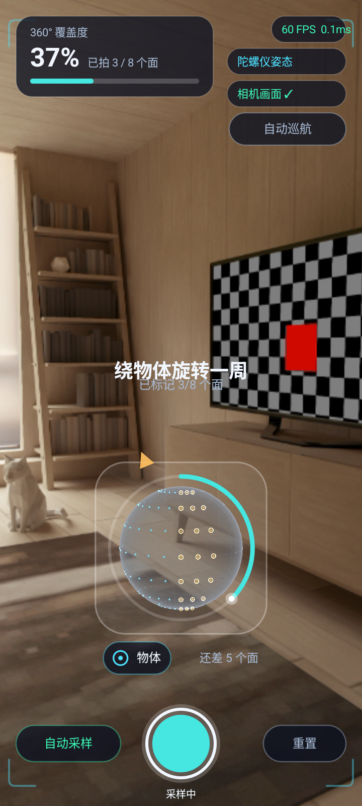

# AR_Ball · GuideSphere 引导球

> Android 端「3D 扫描引导球」：在相机实时画面上叠一个**灰色半透明球**，
> 球面按 8 个方位面铺满光点。**镜头正对哪个面，哪个面的 21 个光点就整面点亮** ——
> 绕着物体转一圈，8 个面全部点亮，就说明 360° 无死角素材拍齐了，可以交给重建算法。

<p align="center">
  
</p>

- **一次拍摄 = 一个面**：不是逐点去凑。绕物体转一圈 **8 次拍摄**即可 100%（不是 168 次）。
- **判定不需要相机内参**：只看「手机现在正对着哪个方位面」，换镜头/换焦距都不影响。
- **稳定 60 FPS**：单帧 3 次 draw call，绘制耗时 0.07 ~ 0.2 ms（模拟器）/ 0.2 ~ 1.4 ms（真机）。
- 无第三方 UI 依赖，全部 Kotlin + OpenGL ES 3.0 + Canvas 自绘，11 个文件共约 3600 行。

---

## 目录

- [一、核心概念](#一核心概念)
- [二、界面说明](#二界面说明)
- [三、快速上手](#三快速上手)
- [四、推荐操作流程](#四推荐操作流程)
- [五、参数与可调项](#五参数与可调项)
- [六、日志与诊断](#六日志与诊断)
- [七、目录结构](#七目录结构)
- [八、常见问题](#八常见问题)
- [九、兼容性与性能](#九兼容性与性能)
- [十、文档与交付物](#十文档与交付物)

---

## 一、核心概念

3D 重建需要被摄物体**各个角度**的照片。这个模块解决的是「拍到什么程度算够、还差哪边」——
它在相机画面上叠一个引导球：

| 概念 | 说明 |
| --- | --- |
| **引导球** | 半透明灰色球壳，代表**被摄物体本身**。球心 = 物体、球面 = 拍摄方向 |
| **面（扇区）** | 球面按**方位角**切成 8 个 45° 的竖直楔形，每个面 = 一次拍摄 |
| **光点** | 每个面内 3 列 × 7 行 = **21 个点**，共 **168 点**。整面一起点亮，只是为了让「面」看得见 |
| **已拍面** | 青绿点阵。镜头正对该面并稳定停留 `≈0.22 s`（自动采样），或按下快门（手动）即整面点亮 |
| **目标面** | 琥珀色整面高亮 + 呼吸外环，是「下一个该扫这一片」的提示；球外还有一枚琥珀箭头指示转向 |
| **覆盖度** | 已点亮光点 / 168。8 个面全亮 = `100%` = 可以提交给重建算法 |

**为什么按「面」而不是「点」？** 168 个点逐个去凑意味着用户要对着 168 个方向一次次对准，
实际拍摄次数不可接受。按面组织后，**绕物体水平转一圈就能拍满 8 个面**，符合「拍摄」这件事
本身的粒度。

**球为什么停靠在底部？** 中间大片区域要留给真实相机画面，用户得看清自己正在拍什么。
球体只占屏幕短边的 34%，通过**投影矩阵纵向偏移**（`proj[9] = 2*(SPHERE_ANCHOR_Y - 0.5)`）
挪到画面下方 68% 处，相机与模型矩阵都不动 —— 这样球心仍在相机光轴上，朝向判定与菲涅尔边缘
光都不会失真。详见[实现文档 §四.8](docs/IMPLEMENTATION.md)。

---

## 二、界面说明

```
┌────────────────────────────────────────────┐
│ ┌──────────────┐              ┌──────────┐ │
│ │ 360° 覆盖度   │              │ 60 FPS   │ │  ← 帧率 / 单帧耗时
│ │ 44%          │              ├──────────┤ │
│ │ 已拍 3/8 个面 │              │ 陀螺仪姿态 │ │  ← 当前姿态来源
│ │ ▓▓▓▓▓░░░░░   │              ├──────────┤ │
│ └──────────────┘              │ 相机画面 ✓ │ │  ← 相机状态
│                               ├──────────┤ │
│                               │ 自动巡航   │ │  ← 一键演示
│              ┌ 已捕获 +21 ┐    └──────────┘ │
│                                            │
│              绕物体旋转一周                   │  ← 中央引导文字
│              已标记 3/8 个面                  │
│                                            │
│        ╭───────────────────────╮           │
│        │      ◜◝  (覆盖度环)     │           │
│        │    ╭───────────╮      │           │
│        │    │  灰色引导球 │  ▶   │           │  ← 琥珀箭头 = 该往哪边转
│        │    ╰───────────╯      │           │
│        ╰───────────────────────╯           │
│           ◉ 物体          还差 5 个面        │  ← 球体停靠面板
│                                            │
│  ┌────────┐   ╭────╮   ┌────────┐          │
│  │ 自动采样 │   │ ●  │   │  重置   │          │  ← 快门在正中
│  └────────┘   ╰────╯   └────────┘          │
│               采样中                        │
└────────────────────────────────────────────┘
```

按钮与状态一览：

| 控件 | 位置 | 作用 |
| --- | --- | --- |
| **快门** | 底部正中 | 手动模式下按一下 = 拍下当前正对的那个面 |
| **自动采样 / 手动快门** | 底部左 | 切换模式。自动采样：对准即整面点亮；手动：只有按快门才记录 |
| **重置** | 底部右 | 清空全部覆盖数据，从 0 重新开始 |
| **自动巡航** | 右上第三行下方 | 一键启动/停止绕物体水平环绕（约 16 s 一圈），没有传感器的设备也能演示 |
| **覆盖度环** | 套在球外 | 半径/圆心由渲染线程实时回传，永远严丝合缝跟着球 |
| **琥珀箭头** | 环外 | 指向目标面在屏幕上的方向；接近时自动淡出 |
| **中央文字** | 画面中部 | 未完成「绕物体旋转一周 + 已标记 N/8 个面」；完成「采集完成」 |
| **完成横幅** | 顶部 | 8 个面全满时弹出「360° 无死角覆盖完成」 |

> 球体面板右下角那行状态文字会按情况切换：
> `待授权 / 无相机 / 全部覆盖 ✓ / 缓慢环绕物体 / 框内 N 个 / 还差 N 个面`。

---

## 三、快速上手

### 方式 A：直接装现成的 APK

```bash
adb install -r deliverables/GuideSphere.apk
```

- 首次启动会申请**相机权限**；拒绝也不影响体验 —— 会退化成「引导球 + 渐变底」，功能照常。
- 没有方向传感器的设备（部分模拟器）会自动降级为**手指拖拽旋转**，并额外可用「自动巡航」。

> `deliverables/GuideSphere.apk` 是演示签名包，可直接安装；正式发布请按方式 B 用你自己的密钥签名。

### 方式 B：从源码构建

**环境**：JDK 17、Android SDK（`compileSdk 37`）。工程内**没有 `gradlew`**，
请用本机 Gradle 9.6 或自己生成 wrapper。

```bash
cd GuideSphere
echo "sdk.dir=/path/to/Android/Sdk" > local.properties   # 指向你的 SDK

gradle assembleRelease        # 产物：app/build/outputs/apk/release/app-release.apk
gradle assembleDebug          # 或只出 debug 包
```

**关于签名**：仓库里**不放私钥**。不配置时 release 变体自动回退到 debug 签名，
所以克隆下来就能直接构建出可安装的包。要出正经的签名包，在 `GuideSphere/` 下建
`keystore.properties`（已在 `.gitignore` 中）：

```properties
storeFile=app/keystore/release.jks
storePassword=******
keyAlias=******
keyPassword=******
```

**访问不了 google() / mavenCentral()？** 在 `GuideSphere/gradle.properties` 里
取消注释那四行代理配置；依赖已经进过本地缓存后用 `gradle --offline` 可以完全跳过网络。

**技术栈**：Kotlin 2.3（AGP 9.2.1 内置）+ Gradle 9.6 + AGP 9.2.1，
minSdk 26 / targetSdk 37，OpenGL ES 3.0，CameraX 1.6.2。

---

## 四、推荐操作流程

1. **把物体放在桌上，手机举到能看见它的位置**，让物体大致落在四角取景框中间。
2. 确认左下角显示 **`自动采样`**（默认就是）。
   > 必须是「自动采样」，覆盖度才会随镜头移动累积；「手动快门」下只有按快门才记录。
   > 这是最容易踩的坑：开着巡航 + 手动快门 → 球在转但覆盖率一直是 0。
3. **以物体为中心，缓慢水平转一圈**（人绕着物体走，或人站着慢慢转身）。
   每转到一个新的面并停一下，该面 21 个点会整面亮起，覆盖度按 `+1/8` 跳。
4. 跟着**琥珀色目标面**和**环外箭头**走：箭头指哪边就往哪边转，转过 45° 就换下一个面。
5. 左上角到 **`100%`（已拍 8/8 个面）** 时，顶部会弹出完成横幅，可以提交给重建算法了。

**没时间真机走一圈？** 点右上「**自动巡航**」，球会自动绕物体水平转一圈，
约 16 s 拍满 8 个面 —— 适合演示与功能自检。

**想手动控制？** 随便在屏幕上拖一下就进入手动模式（球跟手指走），
来源芯片会显示 `手动接管`；再点「自动巡航」或重进页面即可交还传感器。

---

## 五、参数与可调项

改这几处就能调整采集粒度与观感，**注意成对出现的联动关系**（改一处必须同步另一处）：

| 想改什么 | 改哪里 | 注意 |
| --- | --- | --- |
| 面的数量（8 → N） | `scan/ScanSession.kt` 的 `SECTOR_COUNT` **和** `ui/HudView.kt` 的 `SECTOR_COUNT` | 两处必须一致，HUD 用它显示 `已拍 N/M` |
| 每面点数 / 总点数 | `gl/SphereGeometry.kt` 的 `SECTOR_COLS`、`ELEV_ROWS` | `SPHERE_DOT_COUNT` 会自动算出；渲染器 `DOT_COUNT` 是同一来源，无需手改 |
| 球体大小 / 停靠位置 | `GuideSphereRenderer.SPHERE_SIZE`、`SPHERE_ANCHOR_Y` | 两个常量渲染器与 HUD 共用，改完全局对齐 |
| 点的大小 | `GuideSphereRenderer.DOT_SIZE_RATIO` | 太小会看不出「面」，太大会糊成一片 |
| 球壳 / 网格 / 光点配色 | `GuideSphereRenderer.drawShell / drawGrid / drawDots` | 半透明球会被背景带偏，改完**采样真实像素**验证，别只看缩略图 |
| 自动采样停留时长 | `ScanSession.FACE_DWELL_SECONDS`（默认 `0.22 s`） | 调小更容易「路过即拍」，调大更稳但更慢 |
| 扇区完成确认延迟 | `ScanSession.CONFIRM_SECONDS`（默认 `0.4 s`） | 用来抵消边界点闪烁导致的状态抖动 |
| 巡航一圈时长 / 俯仰 | `OrientationTracker.AUTO_ORBIT_SECONDS`、`AUTO_ORBIT_ELEVATION` | 覆盖只取决于方位角，俯仰不影响结果 |
| 拖拽灵敏度 | `OrientationTracker.DRAG_DEG_PER_PX` | 每像素转多少度 |

> 更细的原理、以及「为什么这些值不能随便改」（例如 `SCENE` 相关的坐标系事实、
> 跨阶段 uniform 精度、点尺寸上限）都写在[实现文档](docs/IMPLEMENTATION.md)里，动手前建议先看一眼。

---

## 六、日志与诊断

App 每 **0.5 s** 把覆盖度、帧率、姿态来源打到 logcat：

```bash
adb logcat -s GuideSphereStats:I
# I GuideSphereStats: cov=100.0% lit=168/168 faces=8/8 cam=6 target=0 fps=60 drawMs=0.07 rPx=122 cy=1088 next=(0.00,0.00) src=陀螺仪姿态
```

| 字段 | 含义 |
| --- | --- |
| `cov` | 覆盖度（= `lit / total`） |
| `lit` / `total` | 已点亮光点数 / 总数（8 面 × 21 = 168） |
| `faces` | 已确认完成的面数 / 8（比 `lit` 晚 0.4 s 确认） |
| `cam` | 相机此刻正对着的扇区（0~7） |
| `target` | 是否还有待采集的目标面（`1`/`0`） |
| `fps` / `drawMs` | 帧率 / 单帧绘制耗时（预算 16.6 ms） |
| `rPx` / `cy` | 球体投影半径 / 球心纵坐标（核对停靠位置，`cy ≈ 屏高 × 0.68`） |
| `next` | 目标面在设备系下的水平方向（HUD 据此画箭头） |
| `src` | 姿态来源：`陀螺仪姿态` / `加速度+磁力` / `自动巡航` / `手动接管` / `触摸旋转` |

**画面上什么都没有 / 全黑？** 一加 / OPPO 等 ROM 对每个应用的 logcat 有行数配额
（`LOG_FLOWCTRL`），超配额后**应用日志会被静默丢弃**，崩溃栈也看不到。
渲染线程把关键节点**落盘**了，排查时优先看这个文件：

```bash
adb shell run-as com.remy.guidesphere cat /sdcard/Android/data/com.remy.guidesphere/files/gl_diag.txt
# EGL 就绪 / GL 资源创建完成 点尺寸上限=1023.0 / 首帧渲染完成 1080x2344
```

停在哪个阶段，就说明问题在 EGL、着色器编译还是首帧。

---

## 七、目录结构

```
AR_Ball/
├── README.md                      ← 本文件（使用文档）
├── docs/
│   └── IMPLEMENTATION.md          ← 实现文档（架构 / 坐标系 / 算法 / 踩坑）
├── GuideSphere/                    Android 工程
│   ├── settings.gradle.kts
│   ├── gradle.properties           代理配置（默认注释掉）
│   ├── keystore.properties         ← 本机签名口令，已被 .gitignore 排除
│   └── app/
│       ├── build.gradle.kts
│       └── src/main/
│           ├── AndroidManifest.xml
│           ├── res/                布局 / 主题 / 图标
│           └── java/com/remy/guidesphere/
│               ├── MainActivity.kt              页面装配、权限、沉浸式全屏
│               ├── gl/                          渲染层
│               │   ├── GlSphereView.kt          TextureView + 自建 EGL 渲染循环
│               │   ├── GuideSphereRenderer.kt   渲染管线（球壳 → 网格 → 光点）
│               │   ├── Shaders.kt               GLSL ES 3.0 着色器
│               │   ├── SphereGeometry.kt        球壳 / 网格 / 8 面点阵几何
│               │   ├── GlProgram.kt             GL 程序封装
│               │   └── QuatMath.kt              四元数与 3x3 矩阵工具
│               ├── scan/ScanSession.kt          面级覆盖状态机
│               ├── sensor/OrientationTracker.kt 姿态来源三级降级
│               ├── camera/CameraPreviewController.kt
│               └── ui/HudView.kt                纯 Canvas 自绘 HUD
├── deliverables/                  交付物（APK / 演示视频 / 截图）
└── .tools/                        模拟器注入、录屏、离线评估脚本（不参与构建）
```

---

## 八、常见问题

**Q：为什么 App 一启动，覆盖度就已经是 `12.5%（1/8）`，不是 0？**
自动采样模式下「对准即拍」，镜头正对的那个面停留 `≈0.22 s` 就被记录了。这是
「一次拍摄 = 一个面」的固有行为，不是 bug。想从 0 开始就点「重置」，或者切到「手动快门」。
演示视频因此从 `25%（2/8）` 起而不是 0%。

**Q：球一直在转，覆盖率却不动？**
九成是**模式停在了「手动快门」**（左下角）。覆盖累积只发生在「自动采样」模式下，
手动快门必须真的按快门才整面点亮。点一下左下角切回「自动采样」。

**Q：相机预览一片黑，但球是正常的？**
相机会话其实是 active 的，只是镜头对着桌面、暗处或没揭开镜头盖。
真机上这种情况预览就是纯黑，不是绑定失败。

**Q：姿态来源显示「加速度+磁力」，或者一直在「陀螺仪姿态 / 加速度+磁力」之间跳？**
说明旋转矢量（陀螺仪融合）被判定卡死了。判据是**两路信源互相矛盾**：旋转矢量自己累计转动
< 0.5° 持续 > 2.5 s，**且**同期加速度计+磁力计解算的姿态变化 > 8°。
注意**不能**用「N 秒内姿态没变化」当判据 —— 端稳手机不动是常态，那个判据会无条件触发。
如果长期停在这一档，检查是否附近有强磁干扰（磁力计很容易被磁吸支架带偏）。

**Q：球不跟手机转，一直冻在原地？**
进入了手动模式（来源芯片显示 `手动接管` / `触摸旋转`）。这是拖拽接管后的正常状态 ——
手动模式下球跟手指走、不跟手机走。重新进入页面，或点「自动巡航」再关掉，即可交还传感器。

**Q：能只拍上半部分、不拍下面吗？**
可以，切到「手动快门」，只在你想要的方向按快门。但覆盖度不会到 100%，这是预期行为。

**Q：能改成上下也各算一个面吗（8 方位 × 3 俯仰 = 24 个面）？**
可以。`ScanSession` 的 CSR 映射与状态机结构不用动，只要把扇区归属从「只按方位角」
改成「方位角 + 俯仰角」联合判定，并把 `SECTOR_COUNT` 改成 24（记得同步 `HudView`）。
注意此时一次水平环绕已经不够，需要在绕圈之外补上仰 / 下俯。

**Q：真机上能录屏吗？**
这台一加 PKX110（ColorOS / Android 16）**完全禁止 `adb shell screenrecord` 写文件**
（SELinux 写策略 + 该 ROM 裁剪掉了 `--output-format`），所以 `deliverables/` 里的演示视频
是在**模拟器**上录的。真机表现用截图 + 遥测数据佐证。详见[实现文档 §八](docs/IMPLEMENTATION.md)。

---

## 九、兼容性与性能

| 项目 | 结果 |
| --- | --- |
| 最低版本 | Android 8.0（API 26） |
| 相机 | CameraX 后置优先，无相机硬件时自动降级为渐变底 |
| 传感器 | 旋转矢量 → 加速度计+磁力计 → 手动拖拽，三级自动降级，均可自愈 |
| 帧率 | 稳定 60 FPS（跟随 vsync） |
| 单帧绘制 | 模拟器 0.07 ~ 0.2 ms / 真机 0.2 ~ 1.4 ms（预算 16.6 ms） |
| draw call | 每帧 3 次（球壳 / 网格 / 光点） |
| GC | 逐帧路径零分配（状态数组、矩阵、缓冲全部预分配复用） |
| 实测机型 | 一加 PKX110（Android 16 / arm64-v8a / 1080×2344）：冷启动约 56 ms、零崩溃、渲染线程数恒为 1 |

---

## 十、文档与交付物

| 文件 | 说明 |
| --- | --- |
| [`docs/IMPLEMENTATION.md`](docs/IMPLEMENTATION.md) | **实现文档**：架构与每帧数据流、坐标系约定、渲染管线与着色器、面级覆盖算法、传感器仲裁、性能优化、踩坑清单 |
| `deliverables/GuideSphere.apk` | 可安装的 release 包（x86 / x86_64 / arm64-v8a / armeabi-v7a） |
| `deliverables/guidesphere_demo.mp4` | 演示录屏（约 32 s）：绕物体水平一圈，8 个面依次整面点亮，25% → 100% |
| `deliverables/guidesphere_gray_sphere.png` | 截图：灰色球壳 + 8 面点阵 + 已拍 3/8 + 目标面琥珀高亮 |
| `deliverables/guidesphere_real_device.png` | 真机截图（一加 PKX110，上一版视觉） |
| `deliverables/README.md` | 交付清单与实测验证记录 |
| `.tools/` | 模拟器传感器注入（`drive.py`）、一键录屏（`record_demo.py`）、离线覆盖评估（`plan.py` / `analyze.py`） |
